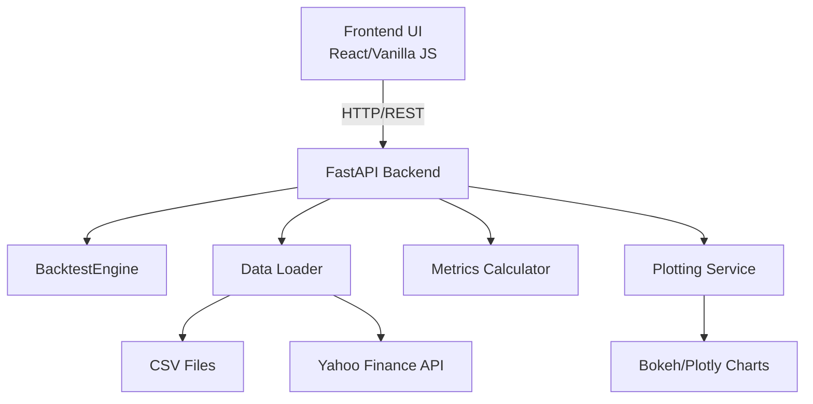

# Web UI Implementation Plan

## Overview

Build a FastAPI backend with a modern frontend (React/vanilla JS) that exposes all current CLI functionality through REST APIs, enabling interactive portfolio backtesting via a web interface.

## Architecture



## Implementation Steps

### 1. Backend Setup (`src/backtest/web/`)

- **`api.py`**: FastAPI app with endpoints:
  - `POST /api/backtest/run` - Execute backtest with parameters
  - `GET /api/data/symbols` - List available symbols (CSV files)
  - `POST /api/data/download` - Download data from Yahoo Finance
  - `POST /api/data/upload` - Upload CSV files
  - `GET /api/backtest/results/{id}` - Retrieve backtest results
- **`schemas.py`**: Pydantic models for request/response validation
- **`service.py`**: Business logic layer wrapping existing engine functions
- **`static/`**: Serve frontend static files

### 2. Frontend (`webui/` or `static/`)

- **`index.html`**: Main HTML page
- **`app.js`**: Frontend logic (vanilla JS or React)
- **`styles.css`**: Modern, responsive styling
- Forms for:
  - Symbol selection (multi-select with available CSV symbols)
  - Weight input (dynamic based on selected symbols)
  - Backtest parameters (initial capital, rebalance frequency, transaction cost, alignment method)
  - Data download form (symbols, date range)
- Results display:
  - Metrics cards (CAGR, Sharpe, Drawdown, etc.)
  - Interactive charts (convert Bokeh to Plotly.js or embed Bokeh server)
  - Download results as JSON/CSV

### 3. Chart Integration

- Option A: Convert Bokeh plots to Plotly.js (better web integration)
- Option B: Embed Bokeh server or export Bokeh plots as static HTML
- Option C: Use Chart.js/D3.js for custom visualizations

### 4. Dependencies (`pyproject.toml`)

- Add: `fastapi`, `uvicorn`, `python-multipart` (file uploads)
- Optional: `plotly` (if converting from Bokeh)

### 5. CLI Compatibility

- Keep existing CLI (`main.py`, `CLI.py`) fully functional
- Share backend logic between CLI and web API

## File Structure

```
backtest/
├── src/backtest/
│   ├── web/
│   │   ├── __init__.py
│   │   ├── api.py          # FastAPI routes
│   │   ├── schemas.py      # Pydantic models
│   │   └── service.py      # Business logic
│   ├── [existing modules...]
├── webui/                  # Frontend
│   ├── index.html
│   ├── app.js
│   └── styles.css
├── main.py                 # CLI entry (unchanged)
└── web_main.py            # Web server entry point
```

## Key Considerations

- Reuse existing `BacktestEngine`, `PortfolioConfig`, `BacktestParams` classes
- Convert Bokeh plots to web-compatible format (Plotly.js recommended)
- Handle async operations for long-running backtests (progress updates)
- File upload handling for CSV data
- Error handling and validation matching CLI behavior
- CORS configuration for development

## Testing Strategy

- API endpoint tests using FastAPI TestClient
- Frontend integration tests
- Ensure CLI still works after changes